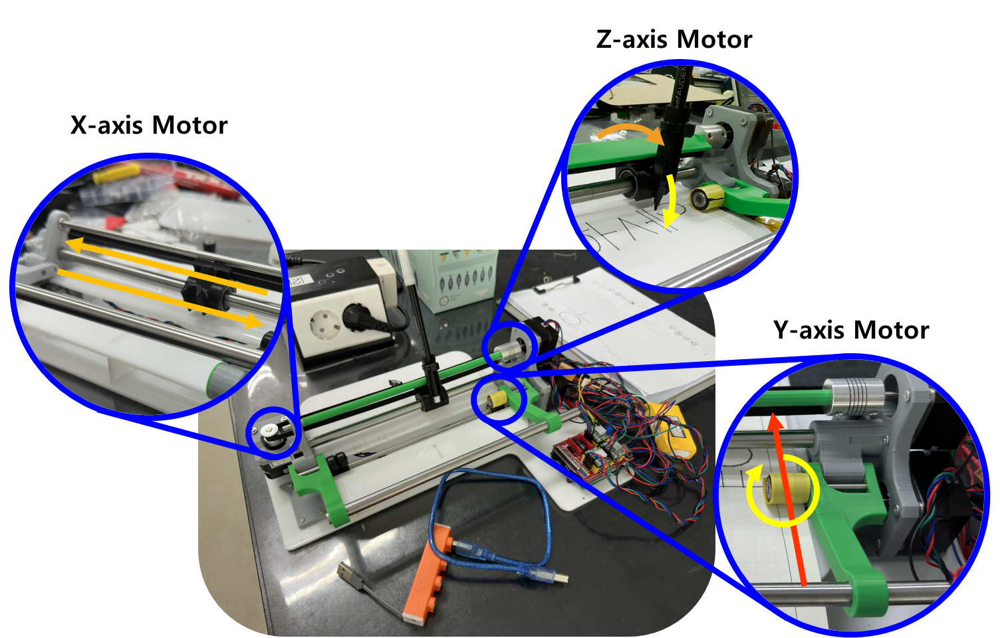

# Pen Plotter for Blind People

**DGIST Undergradurate Student Jihwan Lee**

**DGIST Undergradurate Student Minhyeok Baek**

***MECH404 final report***

*Daegu Gyeongbuk Institute of Science and Technology (DGIST) Spring semester*

# **i**. Introduction

---

### 1. Project Topic:

시각장애인이 일반인들을 위해 제공되는 자료를 읽고 쓰게 할 수 있는 서비스를 제공하기 위한 음성기반 상호작용이 가능한 Pen Plotter의 개발.

### 2. Project Background:

지금까지 점자표지판, 점자 민원, 말하는 간행물 등 시각장애인을 위한 많은 서비스들이 만들어져 왔고, 이러한 서비스들은 실제로 공공기관에서 활용하고자 적극적으로 도입되어 왔습니다. 하지만, 이러한 대부분의 서비스는 사용자들을 배려하지 않아 완성도가 떨어지거나 공공기관에 도입한 이후에 제대로 서비스를 유지하고 관리하지 않아 사실상 활용도가 크게 떨어지는 문제점들을 가지고 있었습니다.

- 선행연구 1: 인쇄물음성변환출력코드(‘보이스아이’)
    
    말하는 공문서, 말하는 간행물과 같은 경우, 공공기관이 발행되는 간행물에 문서에 담긴 글과 미디어파일 등을 압축 저장한 일종의 바코드인 인쇄물음성변환출력코드(일명 ‘보이스아이’)를 첨부하여 제공하면, 시각장애인이 전용 스캐너를 사용해서 이 코드를 스캔해서 제공된 글이나 미디어를 볼 수 있게 해주는 서비스입니다. 이 서비스는 2009년 기준 대한민국 전자정부(G4C) 인터넷 민원서류 130여종과 보건복지부, 문화체육관광부 등 정부부처, 헌법재판소, 국가인권위원회, 서울시청, 서울 강남, 송파, 용산, 종로구청, 부산시청, 제주도청에서 도입되었고 전기요금고지서와 서울시수도요금고지서, 전국 지방세 고지서에서 사용되고 있다고 합니다. 하지만 이 서비스는 2009년 CBS 뉴스와 한국장애인문화협회 소리샵 센터가 공동 비교 분석한 결과 애당초 코드 자체가 읽히지 않거나 시각장애인들이 이해하기 어려울 정도로 잘못 편집된 경우가 많았다고 합니다. [1]
    
- 선행연구 2: 점자민원 서비스
    
    또한 점자 민원과 같은 경우, 공공기관이 발행되는 일반 간행물의 문서에 담긴 글과 미디어파일 등을 점자로 번역하여 시각장애인을 위한 간행물을 따로 제공하면, 시각장애인이 이 점자를 통해 제공된 글이나 미디어를 읽어볼 수 있게 해주는 서비스입니다. 이 서비스는 2016년 만들어진 점자법에 따라 현재 전국의 모든 공공기관이 도입하고 있습니다. [2]
    
    하지만 2020년에 진행된 대구대학교 한국특수교육문제연구소의 연구에 따르면 많은 시각장애인들은 이 서비스에 대해 잘 인지하고 있지 못하고 있고, 심지어 알고 공공기관에 요청함에도 불구하고 서비스를 받을 수 없었다고 합니다. [3][4]
    

때문에 이런 많은 서비스가 있음에도 불구하고 현재까지 시각장애인들은 보조인을 대동하여 민원 신청을 하거나 본인에게 필요한 정보를 찾아보는 것이 대한민국의 시각장애인의 현실입니다.

### 3. Problem Statement:

한 문장으로 정리하면, 공공기관에서 정보를 시각장애인이 인지할 수 있게 많은 서비스를 제공중임에도 시각장애인들은 공공기관의 홍보가 부족하여 이런 서비스들을 인지하지 못하고 있거나, 심지어는 공공기관에서 시각장애인들을 위한 서비스를 적절하게 제공하지 못하고 있는 문제로 인해 시각장애인들은 기본권인 “국민이 정부에 대한 일반적 정보공개를 구할 권리(청구권적 기본권)”과 “주민이 행정 기관에 원하는 바를 요구하는 일(민원)”을 보장받지 못하고 있습니다.

### 4. Approach:

따라서 우리는 공공기관에서 정보를 시각장애인이 인지할 수 있게 이런 많은 서비스를 제공중임에도 제대로 활용되고 있지 못하는 현 상황을 타개하고자. 시각장애인이 일반인들을 위해 제공되는 자료를 로봇을 통해 대리로 읽고 쓰게 할 수 있는 서비스를 만들고자 합니다.

- For Reading
    
    시각장애인이 일반인들을 위해 제공되는 자료를 로봇을 통해 대리로 읽고 쓰게 할 수 있는 서비스를 만들기 위해 우리는 우선 제공되는 자료를 카메라를 통해 보고 이것을 시각장애인이 받아들일 수 있는 감각을 통해 전달하는 기능이 필요하다는 것을 생각했습니다.
    
    일반적으로 시각장애인에게 정보를 전달할 수 있는 수단이라 하면, 대부분 점자와 음성을 떠올릴 것입니다. 하지만 한국의 점자 사용실태에 대해 추가로 조사한 결과, 한국시각장애교육&재활학회에서 발표된 조선대학교의 2015년 연구에서 표본 1000명 중 60%에 가까운 584명이 점자 사용을 하지 않고 있다는 것과, 이 중 100명은 음성지원 보조공학기기를 선호해서, 200명은 점자가 너무 어렵고 읽는 속도가 느려서 사용하지 않고 있다는 것을 확인하였습니다. 이 조사결과를 참고하여 시각장애인이 더 선호하는 음성서비스를 채택하기로 하였습니다. [5]
    
- For Writing
    
    시각장애인이 일반인들을 위해 제공되는 자료를 로봇을 통해 대리로 읽고 쓰게 할 수 있는 서비스를 만들기 위해 우리는 다음으로 시각장애인과 소통하여 시각장애인의 요구를 글로써 적을 수 있는 기능이 필요하다는 것을 생각했습니다. 일반적으로 시각장애인의 요구를 글로써 적을 수 있는 수단은 대부분 프린터를 떠올리겠으나 프린터는 단독적으로 사용될 수 없고 유지 보수에 있어서 많은 비용이 들기 때문에 부적합하다고 판단했습니다. 이 점으로 미루어볼 때, 유지 보수에 큰 비용이 들지 않는 저예산의 로봇팔을 채택하기로 하였습니다.
    

따라서 우리는 구체적으로 글자를 인식할 수 있는 카메라와 글자를 쓸 수 있는 펜 로봇을 조합하고, 음성기반 상호작용이 가능한 Pen Plotter라는 제품을 개발하는 접근법을 통해 이 문제를 해결하고자 했습니다.

# **ii**. Method

---

# 1. Hardware Design

Pen Plotter는 다음과 같이 설계되었습니다.



기존의 x-y axis를 이동하는 Pen Plotter와는 다르게, y축 움직임을 롤러로 대체하여 공간의 컴팩트함을 강조하였습니다. 또한 모든 몸체와 하우징을 3D프린터와 레이저커터를 사용해 조립 가능한 형태로 제작함으로써, 교체 및 수리의 용이성과 제작의 간편함을 추구하였습니다. 바닥면의 경우 아크릴을 사용하여 바닥과의 마찰을 최소로 함과 동시에 평탄함을 잡았습니다. 각 구조에 대해 디테일하게 설명하도록 하겠습니다.

## 1-1) Base design


 틀이 되는 베이스 부분입니다. 기본적으로 조립이 용이하도록 타공 형식으로 나사를 체결할 수 있도록 제작하였으며, 제일 basic한 M3 나사로 체결합니다. 실제 조립에는 진동이나 기타 이동으로 풀리지 않도록 spring washer를 사용해 진동 및 기타 disturbance에 영향을 받지 않도록 조립하였습니다.

각 타공된 구멍에 따른 역할은 다음과 같습니다.

> Yellow: Plotter base
Green: Paper base
Red: Circuit hole
Blue: Wire holder+Case
> 

3mm 아크릴로 제작하였으며, E5의 레이저커터를 사용해 제작했습니다.

## 1-2) X-axis side


X축의 경우, belt를 사용한 일반적인 plotter의 방식을 사용하였습니다. belt만 가지고는 고정력이 부족하기 때문에, 10mm 연마봉을 사용하여 pen을 지지하였습니다. 이 경우 연마봉과 pen 지지대 사이의 마찰력이 움직임에 영향을 줄 수 있기 때문에, ball bush를 사용하여 마찰력을 상쇄하였습니다.


Belt와 pen 지지대는 M3 나사로 체결하여 나사가 belt를 눌러주어 이동에 영향이 가지 않도록 디자인하였습니다.

X축의 최소 이동 거리의 경우, NEMA 17모터의 최소 step이 1.8도이고, 사용한 풀리의 잇수가 20입니다. 따라서 이를 계산하여 보면, 250step 기준으로 1.25바퀴를 회전하게 되고, 이는 25잇수만큼의 회전입니다. 부품의 각 이 간 거리가 2mm이므로, 250step : 50mm = 1step : xmm 를 계산하여 보면 1step = 0.2mm로 계산됩니다. 따라서 x resolution의 최소 단위는 0.2mm임을 알 수 있습니다.

## 1-3) Y-axis side


Y축의 경우, roller를 사용하여 종이를 밀어주는 일반 잉크젯 프린터와 같은 방식을 차용하였습니다. roller는 저가 3D프린터에 주로 사용하는 roller bearing을 사용하였고, 단단한 고정 및 이동을 위해 양쪽에 2개씩, 위 아래로 한 쌍, 총 8개를 사용하여 종이를 단단하고 일정하게 밀어줄 수 있도록 하였습니다. 또한 손잡이를 10mm 연마봉으로 지지함으로써, 지레의 원리로 종이를 무겁게 눌러줌으로써 slip으로 인한 disturbance를 방지합니다.

그럼에도 실제 테스트 시에 종이가 slip하지 않을까 걱정되었지만, 사람이 잡고 있는 손이 끌려들어갈 만큼 slip은 충분하였습니다.

## 1-4) Z-axis side


기존의 돌기를 Z-axis의 lifter가 밀어 펜을 움직이는 방식과 달리, pen 자체를 밀어 움직이도록 하였습니다. 따라서 디자인의 컴팩트함을 더 올렸고, 단순히 belt의 tension으로 pen을 원위치 시키는 것이 아닌 두번째 사진처럼 종이에서 떨어질 때에는 반대방향으로 회전하여 pen을 고정시킴으로써 pen이 앞으로 쏠려 종이에 닿거나 진동으로 인해 종이에 닿는 상황을 막아줍니다. 이는 출력부의 회전을 고정시켜 출력시에 더 안정적으로 이동할 수 있게 해줍니다.

## 1-5) Other details


뒷 부분에는 긴 wire들을 수용할 수 있도록 wire holder를 제작하였습니다. 세 축(X Y Z)의 전선들을 각각 수용할 수 있어 추후 점검이나 부품 교체에 용이하도록 설계하였습니다. 이 역시 spring washer로 조립되어 안정성을 높였습니다. 각 wire들은 unshielded twisted pair로 꼬아 놓음으로써 발생할 수 있는 noise나 간섭에 대해서도 보강하였습니다.

또한 본 시스템의 경우 CNC나 여타 pen plotter에 사용되는 endstop switch가 존재하지 않습니다. 이는 의도한 것으로, endstop 스위치가 가지는 불편한 점을 개선하기 위해 일부러 넣지 않았습니다. 이에 대한 이유는 Software design의 Gcode 부분에서 서술하겠습니다.

# 2. Software Design

다음으로 위와 같은 Hardware를 구동하는 Software는 아래 그림과 같이 설계되었습니다. 


전체적인 Algorithm을 요약해서 설명하자면 다음과 같습니다. 사용자가 컴퓨터에 키보드를 이용해서 한글 문장을 입력하면 Computer는 그 한글 문장을 자모 단위까지 분리하고 자모 Trajectory를 참조해서 글자 하나부터 문장까지 정규화된 계산 방식을 사용해서 차근차근 결합시켜서 하나의 Trajectory를 만들어냅니다. 그리고 Computer는 이 Trajectory를 Gcode 양식으로 변환해서 Serial 통신을 통해 Arduino에 송신합니다. 그러면 이제 Arduino는 Computer로부터 Serial 통신을 통해 들어온 Gcode 양식의 Trajectory를  Step 단위로 바꿔서 각 X축, Y축, Z축 Step 모터를 해당 Step 만큼 움직이는 것을 제어하는 것으로 사용자가 입력한 문장을 A4 종이에 대필하는 것을 수행할 수 있게 됩니다.

이때 설명한 Computer가 수행하는 구체적인 연산은 모두 객체화되어 있습니다. 첫번째로 사용자가 입력한 한글 문장을 한글의 자모 단위까지 분리하고 한 글자 마다 Type을 부여하는 Algorithm은 Hangul Divider라는 이름으로 객체화되어 있습니다. 두번째로 자모 데이터를 참조해서 자모 Trajectory를 추출하는 Algorithm은 Hangul Trajectory Map이라는 이름으로 객체화되어 있습니다. 세번째로 자모 Trajectory를 조합해서 한 문자, 한 단어, 문장까지 이어서 조합하는 Algorithm은 Trajectory Maker라는 이름으로 객체화되어 있습니다.

## 2-1) Hangul Divider Algorithm

앞서 소개했듯 사용자가 입력한 한글 문장을 한글의 자모 단위까지 분리하고 한 글자 마다 Type을 부여하는 Algorithm은 Hangul Divider라는 이름으로 객체화되어 있습니다. 이 Hangul Divider는 [6]에서 소개하는 Algorithm을 펜 플로터 Trajectory 생성을 위해 Concept만 반영하고 다르게 구현된 방식입니다. [6]의 설명에 따르면 한글 unicode에는 아래 사진과 같은 규칙이 있습니다.


우선 한글 unicode는 초성이 588 문자마다 바뀝니다. 이는 즉 한글 unicode를 588로 나누면 그 한글의 초성을 추출할 수 있다는 것을 의미합니다. 또한 한글 unicode는 중성이 같은 초성일 때 28 문자마다 바뀝니다. 이는 즉 한글 unicode에서 초성을 추출한 후 unicode에서 초성값에 588을 곱한 값을 빼주고 28로 나누면 그 한글의 중성을 추출할 수 있다는 것을 의미합니다. 종성도 마찬가지로 초성과 중성이 같을 때 28개가 존재합니다. 따라서 한글 unicode에서 초성을 추출한 후 unicode에서 초성값에 588을 곱한 값을 빼주고 중성값에 28을 곱한 값을 빼주고 28로 나누면 종성을 추출할 수 있습니다. 따라서 Hangul Divider Algorithm은 이를 반영하여 입력된 문장을 글자 하나 하나로 나누고 글자 하나 하나를 초성 중성 종성으로 또 한번 나눕니다.

거기에 Hangul Divider Algorithm은 Trajectory 형성을 위해 한글의 형태에 대한 정보를 분리한 초성 중성 종성 정보에 추가하여 리턴합니다. 한글은 중성이 세로형인지 가로형인지 이중모음인지에 따라 3가지 Type으로 구분되고 각각의 Type은 종성이 있는가에 따라 다시 2가지 Type으로 구분되기 때문에 Hangul Divider Algorithm은 한글의 모양을 다음의 6가지로 정형화 합니다.


이러한 Hangul Divider Algorithm의 Pseudocode는 다음과 같이 정리됩니다.


따라서 이러한 Hangul Divider Algorithm을 실행하면 다음과 같이 문장을 글자 단위로 한번, 초성 중성 종성 단위로 한번 더 분리해주는 기능을 수행해준다는 것을 확인할 수 있습니다.


## 2-2) One Word Making Algorithm

앞서 소개했듯 자모 데이터를 참조해서 자모 Trajectory를 추출하는 Algorithm은 Hangul Trajectory Map이라는 이름으로 객체화되어 있고, 자모 Trajectory를 조합해서 한 문자, 한 단어, 문장까지 이어서 조합하는 Algorithm은 Trajectory Maker라는 이름으로 객체화되어 있습니다. 이 두 Algorithm이 이어져서 한글 한 글자 Trajectory를 만드는 과정은 다음과 같습니다.

우선 Hangul Trajectory Map Algorithm은 Hangul Divider Algorithm에서 분리된 초성 중성 종성을 참조하여 각 문자를 Trajectory로 치환해줍니다. 이때 Hangul Trajectory Map Algorithm은 아래 그림과 같은 초성 Map, 중성 Map, 종성 Map을 보조 자료구조로서 가지고 있기 때문에 이 Map들을 이용해서 초성 중성 종성을 참조하여 각 문자를 Trajectory로 치환하게 됩니다.


Hangul Trajectory Map Algorithm이 각 문자를 Trajectory로 치환하면 다음으로 Trajectory Maker Algorithm은 Hangul Divider Algorithm의 결과값 중에서 해당 글자의 Type을 조회합니다. Trajectory Maker Algorithm은 이 Type에 따라서 아래 사진과 같이 자모 Trajectory를 resize하고 offset을 설정하고 합쳐줌으로써 하나의 글자 Trajectory를 만들어냅니다.


이러한 Trajectory Maker Algorithm에서 Type 1 글자의 Trajectory를 생성하는 function의 Pseudocode는 다음과 같이 정리됩니다.


## 2-3) String Making Algorithm

그러면 이제 Hangul Trajectory Map Algorithm과 Trajectory Maker Algorithm이 한글 한 글자 Trajectory를 만드는 과정을 알아보았으므로, Trajectory Maker Algorithm이 이러한 한 글자 한 글자들이 이어진 단어 및 문장 Trajectory를 어떻게 만들어내는지 알아보도록 합니다. Trajectory Maker Algorithm에서 이러한 한 글자 한 글자들이 이어진 단어 및 문장 Trajectory를 만드는 StringTrajectoryMaking function의 Pseudocode는 다음과 같습니다.


Pseudocode를 보면 확인할 수 있듯 Trajectory Maker Algorithm은 사람이 글씨를 쓰는 것과 상당히 비슷한 방식으로 글씨 Trajectory를 생성합니다. 구체적으로 말하자면 한 글자를 쓰면 그 글자의 가로 크기 만큼 X축으로 이동하여 새 한 글자를 작성하도록 Pseudocode가 만들어져 있습니다. 이때 글자를 X축으로 어느 정도나 이동시켜서 작성할지에 관한 정보는 AccumulatedX라는 변수가 담당하여 계산합니다. 그런데 이 AccumulatedX가 Page의 최대 X길이를 넘어가면 사람이 글을 쓸 때 가로줄을 한줄 다쓰면 줄바꿈을 해서 새 줄을 쓰듯 AccumulatedY가 한 글자 크기만큼 누적되고 accumulatedX가 0부터 다시 출발하도록 되어 있습니다. 이에 따라 단순한 한 글자이던 한 단어이든 한 문장이던 여러 문장이던 상관없이 작성 문서 규격을 고려한 Trajectory를 생성할 수 있다는 것을 알 수 있습니다.

따라서 이러한 String Making Algorithm을 실행하면 다음과 같이 문장에 대응하는 Trajectory를 작성 문서 규격을 고려해서 생성해준다는 것을 확인할 수 있습니다.


## 2-4) Auto Word-Wrap

그런데 지금까지의 Algorithm은 한번 입력받으면 그 한번 입력받은 문장에 대해서만 작성을 완료하면 모든 작업이 완료되도록 만들어져 있습니다. 우리가 최종적으로 만들고자 하는 펜 플로터가 지속적으로 사용자와 상호작용하면서 사용자가 쓰고 싶은 단어를 계속 써주는 것임을 생각해보면 한번 입력받은 문장에 대해서 작성을 완료하면 다음 입력받을 문장을 이어서 작성할 수 있는 추가적인 Algorithm이 필요합니다. 따라서 만들어진 것이 다음그림과 같은 Tree Diagram에 따라 작동하는 Auto Word-Wrap Algorithm입니다.


이 Auto Word-Wrap Algorithm은 한번 입력 받은 문장에 대해 작성을 완료하면 자동으로 줄바꿈을 해서 다음 입력받을 문장을 쓸 준비를 하도록 하는 Algorithm입니다. 이 Algorithm은 Trajectory 형성 단계에서 Trajectory의 마지막 점을 (0, AccumulatedY+1.5*size)로 하여 줄바꿈을 구현하고 이동을 완료했을 때, Zero position setting을 의미하는 Gcode를 Arduino에 전송하는 것으로 시작점을 (0,0)으로 하는 다음 입력받을 문장을 이어서 작성할 수 있도록 구현되었습니다. 그 결과 한번 입력 받은 문장의 작성을 완료하면 다음 줄로 넘어가서 새로 작성할 문장을 입력받고 새로 작성할 문장을 작성한 이후에도 지속적으로 사용자의 문장을 받아 대필하는 작업을 수행할 수 있게 되었습니다.

## 2-5) Gcode

이러한 작업들을 수행하기 위해, Gcode를 새롭게 재설정하였습니다.

기존 pen plotter들의 경우 endstop switch를 사용하여 현재 절대 좌표를 지정한 후 그 이후 움직이는 장점을 가집니다. 이는 원하는 위치에서 출력할 때는 큰 문제가 되지 않지만, 간단히 문서에 작성하는 pen plotter를 지향하는 본 프로젝트에 적합하지 않다 판단하였습니다. 사용자가 원하는 위치에 바로 pen을 가져가 그 위치에서 바로 출력할 수 있는 것이 더 적합하여, 본 프로젝트에서는 현재 위치를 (0,0) 으로 가지는 Gcode protocol을 설정하였습니다.

```python
if Event == 0:
        s.write(('F500' + '\n').encode())
        s.write(('G21' + '\n').encode())
        s.write(('$100 = 5' + '\n').encode()) # x offset 5step = 1mm for y-axis
        s.write(('$101 = 5' + '\n').encode()) # y offset 5step = 1mm for y-axis
        s.write(('$102 = 10' + '\n').encode()) # z offset 5step = 1mm for y-axis
        s.write(('G92 X0 Y0' + '\n').encode())
        s.write(('G04 p0.5\n').encode())
    Event = Event + 1
    
    for dotIndex in range(len(Gcode)):
        s.write((Gcode[dotIndex] + '\n').encode())
        print('Sending: ' + Gcode[dotIndex])
        grbl_out = s.readline() # Wait for grbl response with carriage return
        print(' : ' + grbl_out.strip().decode())
        print('Sending: G04 p0.5\n')
        s.write(('G04 p0.5\n').encode())
        grbl_out = s.readline() # Wait for grbl response with carriage return
        print(' : ' + grbl_out.strip().decode())
    s.write(('G92 X0 Y0' + '\n').encode())
```

G92 항을 추가하여 현재 위치를 (0,0)으로 재설정하며, 출력이 끝난 이후에도 이를 한번 더 반복해 이후 출력에도 똑같이 대응할 수 있게 하였습니다.

```python
def Trajectory2Gcode(trajectory):
    for dotIndex in range(len(trajectory)):
        trajectory[dotIndex] = f"G90 X{round(trajectory[dotIndex][0], 4)} Y{round(5/6*trajectory[dotIndex][1], 4)} Z{1-z_offset*float(trajectory[dotIndex][2])}"
    return trajectory
```

또한 글씨 출력 시 절대좌표로 이동하는 G01을 사용하지 않고 현재 상태에서 이동하는 G92를 사용하였습니다. 따라서 본 작업을 통해 endstop swtich 없이도 더욱 직관적으로 Pen Plotter를 작동시킬 수 있었습니다.

# **iii**. Results

---

위와 같은 Concept를 통해 개발된 펜 플로터를 사용해 다음과 같은 총 4가지 Test를 계획, 진행하였습니다.

### 1. One Word Writing Test

첫번째로 진행한 Test는 원하는 글씨의 크기와 한글 한 글자를 입력했을 때, 펜 플로터가 그 글씨를 정확하게 쓸 수 있는지에 대해 검증하는 실험이었습니다. 이 실험에서는 글자 크기를 10mm로 하고 ‘가’를 입력하였습니다. 그 결과는 아래 사진과 같이 나왔습니다. 이를 통해 본 프로젝트에서 만든 펜 플로터가 입력된 궤적을 큰 오차없이 정확하게 그려내는 것이 가능하다는 것을 검증할 수 있었습니다.


### 2. Multi Word Writing Test

두번째로 진행한 Test는 원하는 글씨의 크기와 한글 한 단어를 입력했을 때, 펜 플로터가 그 단어를 정확하게 쓸 수 있는지에 대해 검증하는 실험이었습니다. 이 실험에서는 글자 크기를 20mm로 하고 ‘과곽’을 입력하였습니다. 그 결과는 아래 사진과 같이 나왔습니다. 이를 통해 본 프로젝트에서 만든 펜 플로터는 한글 두 글자 이상의 단어도 큰 Compuation 문제 없이 처리할 수 있고 입력받은 글자 크기를 반영해서 자유롭게 출력이 가능하다는 것을 검증할 수 있었습니다.


### 3. Word Spacing, Wrap Test

세번째로 진행한 Test는 원하는 글씨의 크기와 한글 한 문장을 입력했을 때, 펜 플로터가 그 문장을 띄어쓰기를 구분하고 자동으로 줄바꿈을 진행하며 정확하게 써내려갈 수 있는지에 대해 검증하는 실험이었습니다. 이 실험에서는 글자 크기를 20mm로 하고 ‘디지스트 기초학부’를 입력하였습니다. 그 결과는 아래 사진과 같이 나왔습니다. 아래 사진을 보면 ‘트’와 ‘기’ 사이에 한 글자 만큼의 space를 정상적으로 반영해서 글자를 작성한 것을 확인할 수 있고 ‘부’가 글자를 작성할 수 있는 범위인 160mm를 넘어가자 그 다음 줄로 자동으로 줄바꿈을 해서 글자를 이어서 작성한 것을 확인할 수 있습니다. 이를 통해 본 프로젝트에서 만든 펜 플로터는 문장 단위도 큰 Compuation 문제 없이 처리할 수 있고 문장이 한 줄 이상을 써야하게 되는 경우에도 자동으로 줄바꿈을 해서 무리없이 모든 문장을 출력할 수 있다는 것을 검증할 수 있었습니다.


### 4. Accuracy Test

네번째로 진행한 Test는 같은 위치에서 같은 한글 한 글자를 반복해서 작성할 때 어느 정도로 오차가 누적되어 글씨가 밀리게 될 것인지를 확인하기 위한 실험이었습니다. 이 실험의 결과는 아래와 같이 나왔습니다. 좌측의 사진은 1cm ‘가’를 입력받았을 때 그 글자를 한번만 작성한 결과이고 우측의 사진은 1cm ‘가’를 입력받았을 때 같은 자리에서 3번 그 글자를 작성한 결과입니다. 육안으로 봐도 확실하게 알 수 있듯 정확하게 전혀 오차 없이 같은 자리에서 글자를 작성했다는 것을 확인할 수 있습니다. 이 결과로 미루어 볼 때, 본 프로젝트에서 롤러를 사용한 펜 플로터도 충분히 입력한 궤적을 정확하게 그려낼 수 있다는 것을 알 수 있습니다. 이는 기존의 다른 펜 플로터들이 종이에 글씨를 정확히 작성하기 위해 종이를 고정하고 펜 플로터를 종이 전체 위를 움직이면서 작성하는 대신 공간 효율성을 포기한 것을 본 프로젝트에서 만든 롤러를 사용한 펜 플로터로 개선할 수 있다는 것을 보여줍니다.


# **iv**. Conclusion

---

### 1. Suggestion point of this project

이 프로젝트가 이루어낸 성과를 정리하자면 다음과 같습니다. 첫번째로 A4 용지 정도의 공간이 확보되어야 사용가능한 기존 펜 플로터와는 다르게 X축, Y축, Z축 모터와 축 부품을 최대한 근접하게 붙여서 설계하여 보다 협소한 공간에서도 작동할 수 있게 만들었습니다. 이는 본 프로젝트에서 제안하는 시각장애인이 관공서에서 공문서를 읽거나 공문서를 작성하는 것을 넘어 일상생활에서 시각장애인이 휴대하면서 문서작성이 필요한 경우에 항상 사용이 가능한 펜 플로터를 만들 수 있다는 가능성을 보여줍니다. 두번째로 영어나 숫자를 쓰는 것에 국한된 기존 펜 플로터들과는 다르게 본 프로젝트에서는 직접 개발한 한글 궤적을 만드는 라이브러리를 통해 펜 플로터가 한글 문장을 작성합니다. 이때 한글 궤적 라이브러리는 Encapsulation이 잘 되어 있고, 궤적을 Gcode값으로 리턴하기 때문에 본 프로젝트에서 만든 펜 플로터에 제한되지 않고 다른 펜 플로터들에도 적용하여 사용할 수 있다는 장점을 가지고 있습니다. 마지막으로 본 프로젝트에서 만든 펜 플로터는 사용자와 실시간 상호작용을 통해 글을 작성하고자 하는 목적에 따라 인터랙티브 입력창 기능과 글씨를 쓰는 펜의 위치를 사용자가 동적으로 변경할 수 있는 기능을 추가 및 구현하였습니다. 이는 인쇄를 시킨 다음에는 상호작용이 불가능한 잉크젯 프린터나 기존의 펜 플로터들과 명확히 구별되는 차이점입니다.

### 2. Points to Improve

하지만 이 프로젝트에서 만들어진 펜 플로터가 모든 면에서 장점을 가진 것은 아닙니다. 현재 본 프로젝트에서 개발한 펜 플로터는 높이가 15mm인 글자 7개를 쓰는데 15분이 걸릴정도로 쓰기 속도가 상당히 느립니다. 이는 개발 과정에서 글씨를 정확하게 쓰는데 집중하여 mm당 Step 수만 고려한 결과에 따라 발생한 문제로 추가로 Gcode를 수정하면 해결될 것으로 보입니다. 다만 속도를 빠르게 함에 따라 진동이 발생할 수 있기 때문에 차후 속도를 빠르게 함에 따라 발생하는 진동을 측정하고 이를 최소화하는 전략을 고안해야 할 것으로 보입니다. 또한 앞에서 이 펜 플로터는 쓰기 시작점을 수동으로 수정할 수 있다는 장점이 있다고 설명하였지만 쓰기 시작점을 수동으로 설정하면 자동 줄 바꿈 기능이 작동하지 않기 때문에 긴 텍스트를 입력하면 펜 플로터가 Task Space 외곽에 부딫혀 고장을 일으킬 가능성이 있습니다. 따라서 이를 해결하기 위해 추가로 End Stop 스위치나 Encoder를 부착하여 펜의 위치가 Task Space 상에서 어디에 위치하고 있는지 피드백해주는 것이 필요할 것으로 보입니다. 마지막으로 본 프로젝트는 터미널에 키보드로 입력한 한글 문장을 대필해주는 펜 플로터의 개발에 성공하였으나 본래 최종 목적은 음성으로 말한 한글 문장을 대필해주는 펜 플로터의 개발이었습니다. 이는 시각 장애인을 위한 시스템을 개발한다는 관점에서 가장 중요했던 기능이었습니다. 따라서 향후 추가될 예정에 있습니다.

# **v**. References

---

- [1].
    
    ['말하는 공문서' 오류 투성이...시각장애인 배려 시늉만](https://www.nocutnews.co.kr/news/4149138)
    
- [2].
    
    [시각장애인도 경찰서에서 쉽게 민원 신청한다](https://www.seoul.co.kr/news/newsView.php?id=20210906500051)
    
- [3].
    
    [시각장애인, 경찰에 ‘점자 통지’ 요청했지만…못 받은 이유는?](https://news.kbs.co.kr/news/view.do?ncd=5496433)
    
- [4]
    
    [시각장애인의 민원 정보 이용 실태와 요구 조사](https://www.kci.go.kr/kciportal/ci/sereArticleSearch/ciSereArtiView.kci?sereArticleSearchBean.artiId=ART002572940)
    
- [5]
    
    [시각장애인의 점자에 관한 인식과 점자 사용 실태](https://www.kci.go.kr/kciportal/ci/sereArticleSearch/ciSereArtiView.kci?sereArticleSearchBean.artiId=ART002031245)
    
- [6]
    
    [https://github.com/bluedisk/hangul-toolkit](https://github.com/bluedisk/hangul-toolkit)